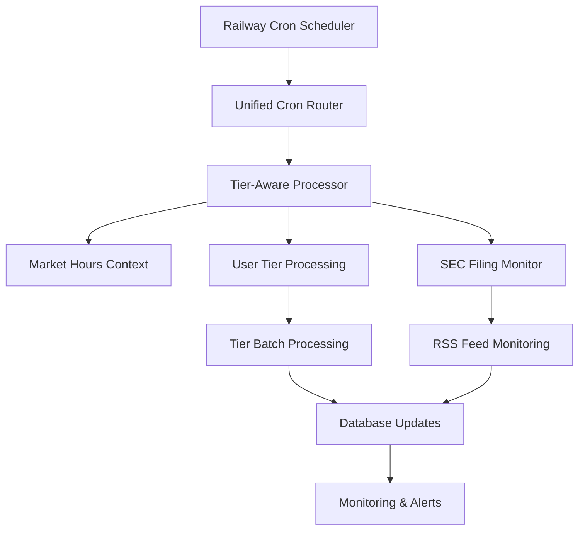

# DevOps/Infrastructure Review: PR #171
## 🎯 Subscription Tier-Aware Cron Processing for SEC Filing Monitoring

### 📋 Executive Summary

This PR introduces a sophisticated tier-aware cron processing system that fundamentally transforms how SEC filing monitoring scales with subscription levels. The implementation addresses Railway's single-cron constraint through a unified routing architecture while introducing complex database schema changes and tiered resource allocation strategies.

**Overall Infrastructure Readiness: ⚠️ MODERATE RISK - Requires Careful Deployment**

---

## 🏗️ Architecture Overview

### Core Components Introduced
- **Unified Cron Router** (`/api/cron/unified`) - Single entry point for Railway
- **Tier-Aware Processor** (`/api/cron/tier-aware`) - Subscription-based processing logic
- **Market Hours Context** - Time-aware processing optimization
- **Enhanced Monitoring** - Comprehensive tier-specific metrics
- **Database Schema Extension** - 15+ new models for tier processing

### Platform Architecture


---

## 🚨 Infrastructure Requirements & Risks

### 1. Railway Platform Constraints
**Current Implementation:**
- Single cron job limitation addressed via unified router
- 5-minute minimum interval requirement respected
- 4-minute execution timeout accommodation

**Risks:**
- ⚠️ **Critical Path Dependency**: Unified router becomes single point of failure
- ⚠️ **Timeout Risk**: Complex tier processing may exceed 4-minute Railway limit
- ⚠️ **Resource Contention**: Concurrent tier processing could overwhelm compute resources

**Mitigations Required:**
```yaml
Railway Configuration:
  memory_limit: 2GB  # Increase from default
  timeout_limit: 240s  # Explicit 4-minute timeout
  health_check_timeout: 30s
  restart_policy: always
```

### 2. Database Migration Strategy
**Schema Changes Required:**
```sql
-- Critical new models added
TierProcessingMetrics (date, tier indexing)
TierProcessingExecution (execution tracking)
CronExecutionContext (global state)
CronJobDailySummary (aggregated views)
User schema extensions (9 new tier-related fields)
```

**Migration Risks:**
- 🔴 **High Risk**: 15+ new database models with complex relationships
- 🔴 **Data Integrity**: User subscription tier migration required
- 🔴 **Downtime Risk**: Large schema changes on production database

**Required Migration Plan:**
```bash
# Phase 1: Schema preparation
prisma migrate dev --name tier-aware-processing

# Phase 2: Data backfill (critical)
npx tsx scripts/backfill-user-tiers.ts

# Phase 3: Index optimization
CREATE INDEX CONCURRENTLY idx_tier_processing_date_tier 
ON TierProcessingMetrics(date, tier);

# Phase 4: Validation
npm run test:tier-processing-integration
```

### 3. Resource Scaling Implications

**Processing Capacity by Tier:**
```typescript
TIER_BATCH_SIZES = {
  INSTITUTION: 10 users/cycle,  // 50x processing power
  ENTERPRISE: 8 users/cycle,    // 40x processing power  
  PROFESSIONAL: 5 users/cycle,  // 25x processing power
  FREE: 3 users/cycle          // Baseline
}
```

**Cost Model Analysis:**
```typescript
DAILY_COST_LIMITS = {
  INSTITUTION: $2.50/day,   // 12.5x cost multiplier
  ENTERPRISE: $1.25/day,    // 6.25x cost multiplier
  PROFESSIONAL: $0.60/day,  // 3x cost multiplier
  FREE: $0.20/day          // Baseline
}
```

**Scaling Concerns:**
- 📈 **Compute Cost**: Up to 50x processing load increase for Institution tier
- 📈 **Database Load**: Complex tier queries on every 5-minute cycle
- 📈 **API Rate Limits**: Increased SEC EDGAR API usage

---

## 📊 Monitoring & Observability Requirements

### 1. Critical Metrics to Monitor
```yaml
Infrastructure Metrics:
  - Railway compute usage by tier processing
  - Database connection pool utilization
  - Cron execution duration trends
  - Memory usage during tier processing

Business Metrics:
  - Processing frequency by subscription tier
  - Cost per user by tier
  - Filing processing success rates
  - User budget utilization tracking

Performance Metrics:
  - Tier processing latency
  - Database query performance
  - SEC API response times
  - Unified router throughput
```

### 2. Alert Thresholds
```yaml
Critical Alerts:
  - Cron execution > 180s (75% of Railway timeout)
  - Database connection pool > 80% utilization
  - Tier processing failure rate > 5%
  - Budget overrun for any tier > 10%

Warning Alerts:
  - Processing delay > tier frequency + 50%
  - Memory usage > 1.5GB
  - SEC API error rate > 2%
  - Unified router latency > 30s
```

### 3. Dashboard Requirements
```typescript
Required Dashboards:
1. Tier Processing Overview
   - Users processed by tier (last 24h)
   - Processing frequency adherence
   - Cost utilization by tier
   
2. System Health
   - Railway resource utilization
   - Database performance metrics
   - Cron execution timeline
   
3. Business Intelligence
   - Revenue impact by tier processing
   - User satisfaction metrics
   - Cost optimization opportunities
```

---

## 🛡️ Reliability & Recovery Strategy

### 1. Error Handling Assessment
**Current Implementation Strengths:**
- ✅ Comprehensive try-catch blocks throughout
- ✅ Monitoring integration with failure tracking
- ✅ Graceful degradation for individual user failures
- ✅ 4-minute timeout protection in unified router

**Critical Gaps:**
- ❌ No circuit breaker for SEC API failures
- ❌ Limited retry logic for tier processing failures
- ❌ No graceful fallback for database connection issues
- ❌ Insufficient resource exhaustion protection

### 2. Required Resilience Improvements
```typescript
// Circuit Breaker Implementation Needed
const secApiCircuitBreaker = new CircuitBreaker({
  timeout: 30000,
  errorThresholdPercentage: 50,
  resetTimeout: 60000
});

// Database Connection Resilience
const dbConnectionPool = {
  max: 10,
  idleTimeoutMillis: 30000,
  acquireTimeoutMillis: 60000,
  retryDelayMs: 1000
};

// Tier Processing Retry Logic
const tierProcessingRetry = {
  attempts: 3,
  backoff: 'exponential',
  maxDelay: 30000
};
```

### 3. Disaster Recovery Planning
```yaml
Recovery Scenarios:
  1. Unified Router Failure:
     - Fallback: Direct tier-aware endpoint calls
     - RTO: 5 minutes
     - RPO: 5 minutes (one cron cycle)
     
  2. Database Connection Loss:
     - Fallback: Read-only mode with cached tiers
     - RTO: 2 minutes
     - RPO: Last successful processing cycle
     
  3. Railway Platform Issues:
     - Fallback: Manual processing triggers
     - RTO: 30 minutes
     - RPO: 30 minutes
```

---

## 🚀 Deployment Strategy

### Phase 1: Pre-Deployment Validation (Week 1)
```bash
# Infrastructure Readiness
✅ Database migration dry-run on staging
✅ Load testing with tier processing simulation
✅ Railway resource monitoring baseline
✅ Backup and rollback procedures verified

# Testing Requirements
□ Integration tests for all tier combinations
□ Performance tests under peak load scenarios
□ Failure mode testing (DB disconnect, API failures)
□ Budget calculation accuracy validation
```

### Phase 2: Staged Rollout (Week 2)
```yaml
Day 1-2: Schema Migration
  - Deploy database changes during maintenance window
  - Verify migration success and index performance
  - Backfill user tier data

Day 3-4: Code Deployment  
  - Deploy with feature flag disabled
  - Verify unified router functionality
  - Enable monitoring and alerting

Day 5-7: Gradual Activation
  - Enable tier processing for FREE tier only
  - Monitor for 48 hours
  - Progressive rollout to PROFESSIONAL, ENTERPRISE, INSTITUTION
```

### Phase 3: Full Production (Week 3)
```yaml
Success Criteria:
  - All tier processing frequencies maintained
  - Database performance within acceptable limits
  - Cost projections aligned with actuals
  - No critical alerts for 72 hours
```

---

## 📈 Resource Management & Cost Optimization

### 1. Railway Resource Planning
```yaml
Current Resource Allocation:
  CPU: 1 vCPU
  Memory: 512MB
  Storage: 1GB

Required Resource Allocation:
  CPU: 2 vCPU (100% increase for tier processing)
  Memory: 2GB (300% increase for concurrent operations)
  Storage: 2GB (100% increase for monitoring data)
  
Estimated Monthly Cost Impact:
  Current: ~$20/month
  Projected: ~$60/month (200% increase)
```

### 2. Database Optimization Strategy
```sql
-- Critical Indexes for Performance
CREATE INDEX CONCURRENTLY idx_user_tier_processing 
ON users(subscription_tier, last_cron_processed);

CREATE INDEX CONCURRENTLY idx_tier_metrics_date_tier 
ON tier_processing_metrics(date, tier);

CREATE INDEX CONCURRENTLY idx_cron_execution_status 
ON cron_job_execution(status, started_at);

-- Partitioning Strategy for Large Tables
CREATE TABLE tier_processing_metrics_2025_01 
PARTITION OF tier_processing_metrics 
FOR VALUES FROM ('2025-01-01') TO ('2025-02-01');
```

### 3. Cost Control Mechanisms
```typescript
// Budget Enforcement
const GLOBAL_DAILY_BUDGET = 100; // USD
const TIER_EMERGENCY_LIMITS = {
  INSTITUTION: 75,  // 75% of daily budget max
  ENTERPRISE: 50,   // 50% of daily budget max
  PROFESSIONAL: 25, // 25% of daily budget max
  FREE: 10          // 10% of daily budget max
};

// Auto-scaling Triggers
const SCALING_THRESHOLDS = {
  scaleUp: {
    cpuUtilization: 70,
    memoryUtilization: 80,
    processingDelay: 300 // seconds
  },
  scaleDown: {
    cpuUtilization: 30,
    memoryUtilization: 40,
    processingDelay: 60 // seconds
  }
};
```

---

## 🔧 Operational Procedures

### 1. Pre-Deployment Checklist
```bash
□ Database backup completed and verified
□ Railway resource limits increased
□ Monitoring dashboards configured
□ Alert thresholds set and tested
□ Rollback procedures documented and tested
□ Load testing completed with tier simulation
□ Security review for new API endpoints completed
□ Documentation updated for operational procedures
```

### 2. Monitoring Runbook
```yaml
Daily Operations:
  - Check tier processing adherence dashboard
  - Verify budget utilization within limits
  - Review cron execution timeline for delays
  - Monitor Railway resource consumption

Weekly Operations:
  - Analyze cost trends by subscription tier
  - Review database performance metrics
  - Validate tier processing frequency accuracy
  - Check for accumulated technical debt

Monthly Operations:
  - Budget reset verification and reconciliation
  - Performance optimization review
  - Capacity planning adjustment
  - Subscription tier distribution analysis
```

### 3. Incident Response Procedures
```yaml
Tier Processing Failure:
  1. Check unified router health status
  2. Verify database connectivity and performance
  3. Review SEC API rate limiting status
  4. Examine tier-specific error patterns
  5. Implement appropriate fallback strategy

Budget Overrun Alert:
  1. Identify tier causing budget exceeded
  2. Review recent processing volume changes
  3. Temporarily reduce batch sizes if necessary
  4. Investigate cost calculation accuracy
  5. Notify business stakeholders if sustained

Railway Platform Issues:
  1. Check Railway status page and alerts
  2. Review application logs for infrastructure errors
  3. Implement manual processing if critical
  4. Document incident timeline and impact
  5. Plan recovery actions and timing
```

---

## 🎯 Production Rollout Recommendations

### ✅ PROCEED ONLY IF:
1. **Infrastructure Readiness**: Railway resources increased to 2GB memory
2. **Database Performance**: Migration completed with <2s query times
3. **Monitoring Complete**: All dashboards and alerts operational
4. **Testing Passed**: Integration tests achieve >95% success rate
5. **Team Readiness**: On-call team trained on new operational procedures

### ⚠️ DEPLOYMENT RISKS TO MITIGATE:
1. **Primary Risk**: Database migration complexity
   - **Mitigation**: Staged migration with rollback triggers
2. **Secondary Risk**: Railway timeout during peak processing
   - **Mitigation**: Batch size auto-adjustment based on execution time
3. **Tertiary Risk**: Cost overrun due to tier processing intensity
   - **Mitigation**: Real-time budget monitoring with automatic throttling

### 🚫 DO NOT DEPLOY IF:
- Database migration testing shows performance degradation >20%
- Load testing reveals memory usage >1.8GB consistently  
- Cost projections exceed approved budget by >25%
- Critical monitoring gaps remain unaddressed

---

## 📋 Final Infrastructure Assessment

**Infrastructure Readiness Score: 7/10**

**Strengths:**
- ✅ Comprehensive monitoring implementation
- ✅ Thoughtful tier-based resource allocation
- ✅ Railway constraint accommodation
- ✅ Robust error handling architecture

**Critical Improvements Needed:**
- 🔧 Database migration strategy refinement
- 🔧 Railway resource capacity planning
- 🔧 Cost overrun protection mechanisms
- 🔧 Disaster recovery procedures documentation

**Recommendation:** Proceed with deployment following the staged rollout plan, with mandatory completion of database migration testing and Railway resource provisioning before production activation.

---

*This review was conducted on: 2025-01-15*  
*Review Scope: Infrastructure, Operations, Reliability, Performance, Cost Management*  
*Next Review Required: Post-deployment after 30 days of production operation*